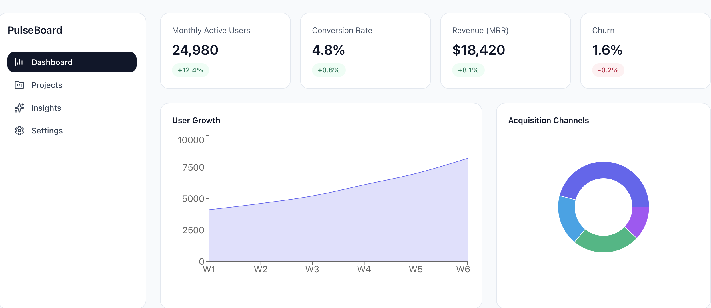
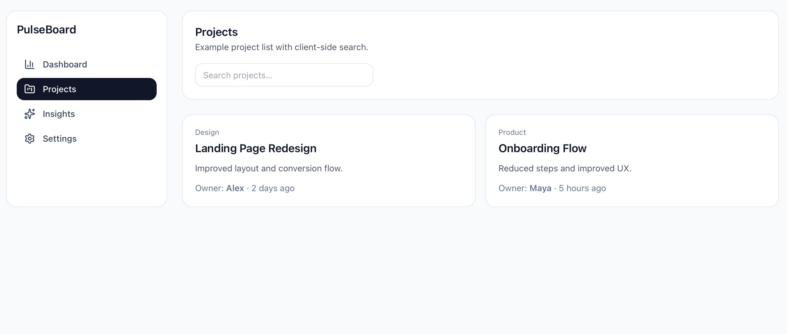
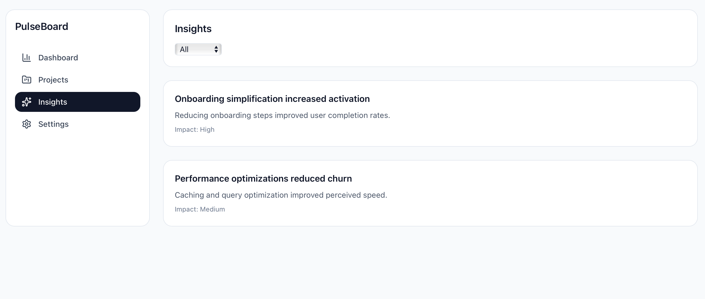
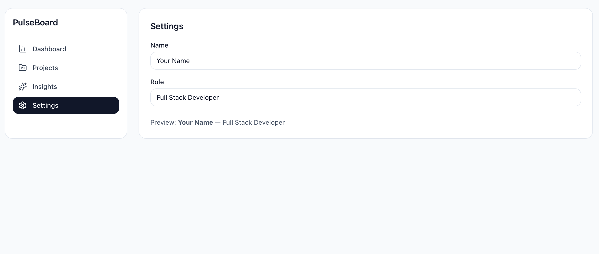

Pulseboard

Pulseboard is a modern front-end dashboard built to visualize data in a clean, responsive interface.

Screenshots

Tech Stack
- JavaScript
- Vite
- Tailwind CSS

Features
- Dashboard-style UI
- Responsive layout
- Component-based structure

Notes
This is a front-end focused project.

